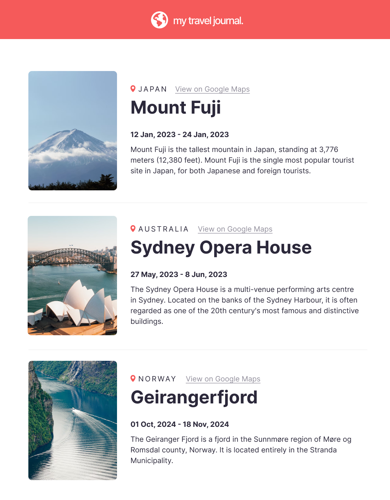

# 🌍 Travel Journal

A personal travel blogging application built with **React**. Document your adventures, save memories, and share your journey with the world.

---

## ✨ Features

* **View Entries:** See a list of all your recorded travel entries.
* **Add New Entry:** Easily create a new journal entry with details like location, date, title, description, and photos.
* **Interactive Map (Optional):** Visualize entry locations on a map interface (e.g., using Leaflet or Google Maps API).
* **Photo Gallery:** Display associated images for each travel entry.

---

## 🛠️ Tech Stack

* **Frontend:** React (for the user interface)
* **Styling:** CSS Modules / Styled Components / Tailwind CSS (Choose the relevant one)
* **Routing:** React Router DOM
* **State Management:** React Hooks (e.g., `useState`, `useEffect`) / Redux (If used)

---

## 🚀 Getting Started

### Prerequisites

You need **Node.js** and **npm** (or yarn) installed on your system.

### Installation

1.  **Clone the repository:**
    ```bash
    git clone [YOUR_REPO_URL]
    cd travel-journal
    ```

2.  **Install dependencies:**
    ```bash
    npm install
    # or
    # yarn install
    ```

### Running the App

1.  **Start the development server:**
    ```bash
    npm start
    # or
    # yarn start
    ```
2.  Open your browser to **`http://localhost:3000`** to view the application.

### Contributions

Thank you to Scrimba Community for the project assests and guidance!
